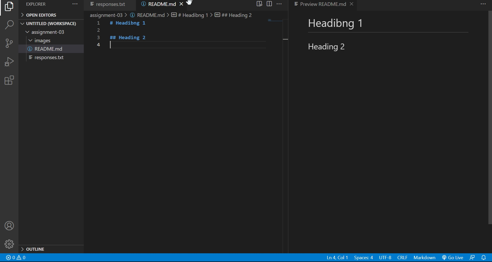

# Practice
## Headbng 2
### Heading 3

Absolute Pass
[University of Montana](https://www.umt.edu/)

Relative Pass
[My Responses](responses.txt)

# Assignment
## 1:Tell me three things you have learned in this class so far.
- Github setting
- How the internet works
- Anatomy of a URL

## 2:Link to your responses.txt file with a relative URL
[My Responses](responses.txt)

## 3:Link to your screenshot with a relative URL
