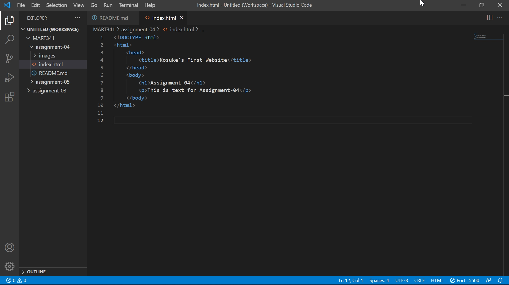

# Assignment04

## Question1 
Browsers work by displaying a document written in HTML for human readability, sending a request to a server, receiving the required information, and making hyperlinks work.
- Safari
- Google Chrome
- Microsoft Edge
- Firefox

## Question2
