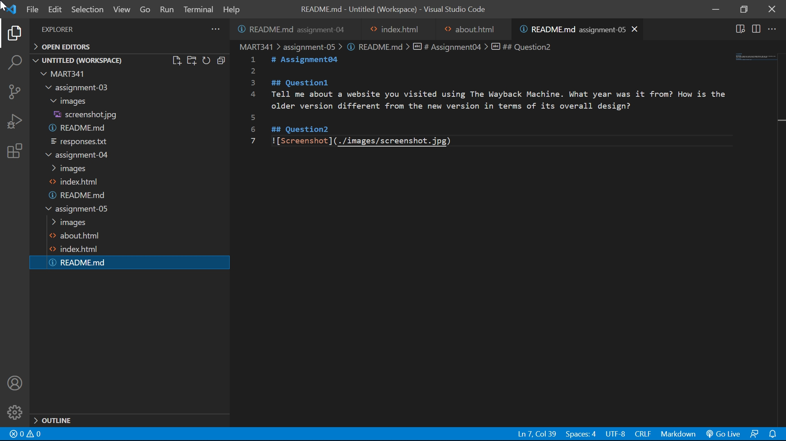

# Assignment04

## Question1 
I chose a website of University of Montana, https://www.umt.edu/. The oldest version stored in The Wayback Machine was January 19, 1997. The oldest version is different from new one in that the top page was just a collection of links, and users had to follow the links many times until they reach the desired page.

## Question2
