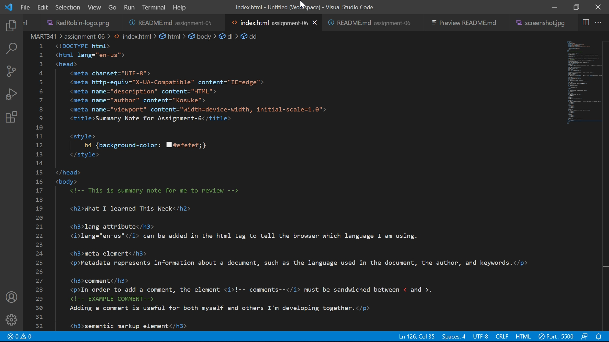

# Assignment06

## Question
The difference between semantic and structural markup

Semantic markup is to markup with tags that match the meaning of the content.
Structural markup is trelated to page structure and layout.

## Screenshot
