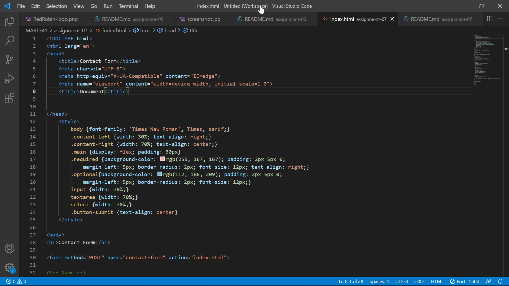

# Assignment07

## Question
please describe any forms you've come across while browsing the web. What purposes do they serve?

When I am browsing Moodle, the site asks me to enter my NetID and password. The purpose of this form is to show an unique site to each student depending on the ID and the appropriate password.

## Screenshot
