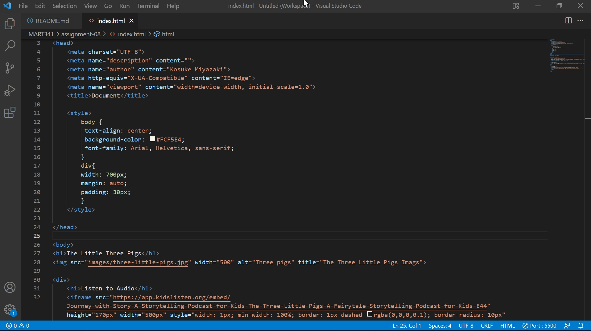

# Assignment08

## What is an affordance?
In terms of design, affordance is the most basic object feature that determines how people use the object.

## What are the advantages and disadvantages of using a third-party service like YouTube or Vimeo to host your videos?
The advantage is effortless because all we have to do is copy and paste a code from a third-party service.
The advantage is that ads can run and it is difficult to change the design.

## Optional: What challenges did you face this week with this assignment? How did you overcome them?
At first, I did not know why we had to add two types of <source> to embed media; mp4 and webm. To find it out, I just googled it and found out that the two video formats were needed a browser may not support one of them.

## Screenshot
