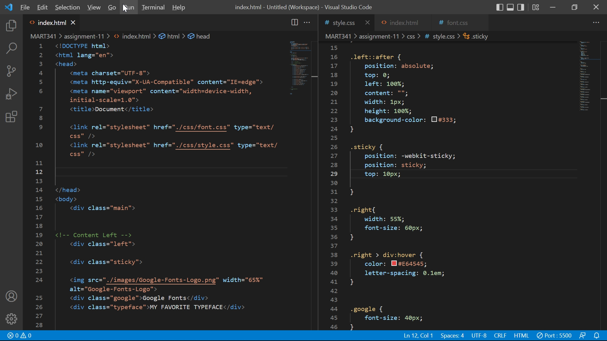

# Assignment11

## Questions
- What is typography?
The world "typography" today refers to everything related to letters or words in the field of art and design. Especially, it basically refers to how to make letters for easier to read and to arrange letters to fit contexts. 

- What is the importance of having fallback fonts or a font stack?
We could select and use the most appropriate font depending on the messenge that we want to tell. When it comes to designers, it would be better for them to stock as many fonts as possible because they can meet clients' needs.

- What is the difference between a system font, web font, and web-safe font?
A system font is a font pre-installed on computers or smartphones. 
A web font is a fonts that is external to a user's device, such as on the Internet.
A web-safe font is a font 
A web-safe font is a font that developers can count on being available by the system.

## Screenshot
