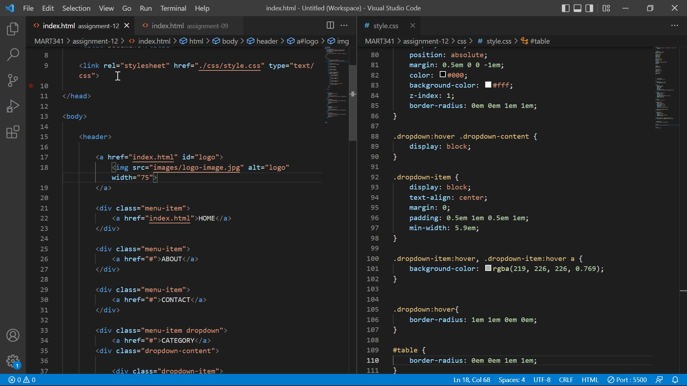

# Assignment11

## Question
- What is the difference between padding, margin, and borders?
A padding is the space between an element's border and the element's content
A margin is the space around an element's border
A border is the the space between a padding and a marin.

## Screenshot
