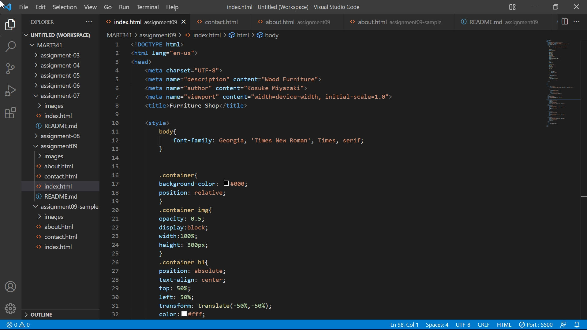

# Assignment09

## Question1
Briefly recap your experience learning HTML. What was old, new, interesting, or difficult to learn?

what was old:
HTML is essential for displaying contents in websites.

what was new:
I did not know I could decorate contents within HTML seats without using CSS style seats.

what was difficult to learn:
I was not sure how much I had to learn HTML tags and elements by my heart. I had a hard time in knowing frequency of use and priority of them.

## Question2
After we come back from spring break we will start to dive into CSS and expand on styling, which helps us "decorate" HTML. Is there anything you're anxious or excited to learn about in this new section?

I want to learn the way to code CSS simply wiht a small number of lines.

## Screenshot
