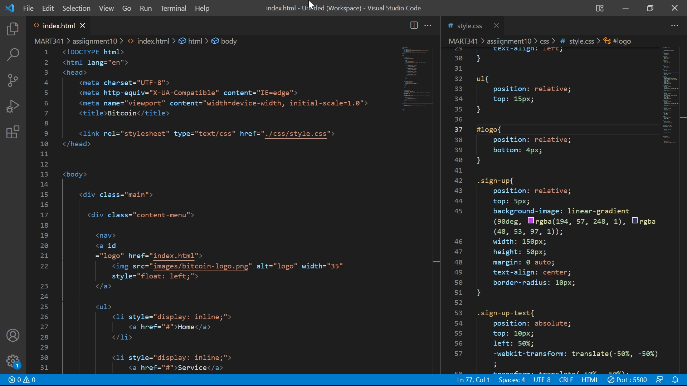

# Assignment10

## Describe the difference between the universal, element, class, and id selector types. When might you choose one over the other to style content?

They are difference in terms of the scale or quantity of elements targeted by a selector. I might use class selector instead of id selector when I feel it troublesome to worry about whether I am using the same id only once properly.

## Discuss your color palette. How did you choose your colors?
I decided the image to use first and extracted the colors in it.

## Optional: discuss any challenges you faced this week, and how you overcame them.

I didn't understand why the part of "LEARN MORE" in my assignment wasn't treated as a link even though I uesed a tag.

## Screenshot
